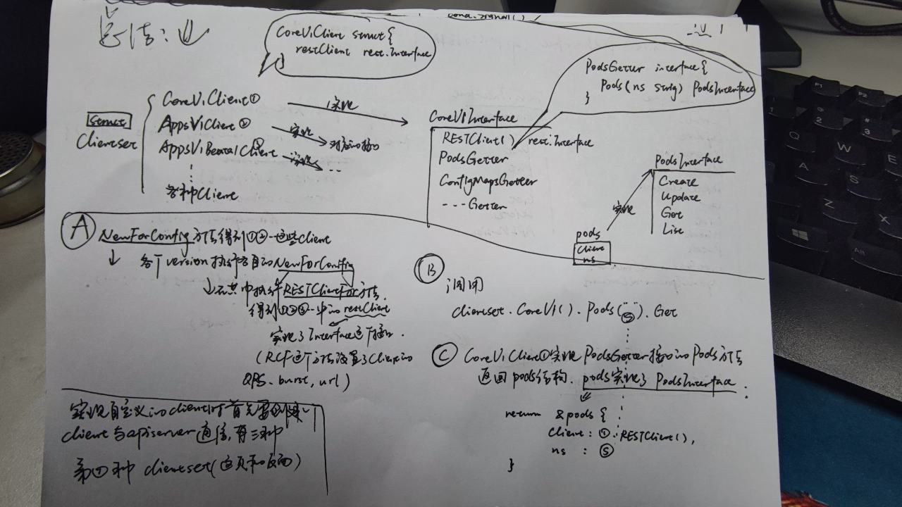
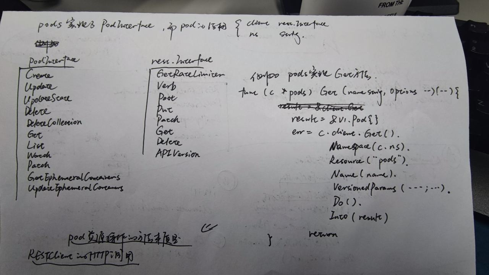

[TOC]


### 1. 使用client-go简述

典型的访问 Kubernetes 集群资源的方式，通过 client-go 提供的 Clientset 对象来获取资源数据，主要有以下三个步骤：

1. 使用 kubeconfig 文件或者 ServiceAccount（InCluster 模式）来创建访问 Kubernetes API 的 Restful 配置参数，也就是代码中的 `rest.Config` 对象


1. 使用 rest.Config 参数创建 Clientset 对象，这一步非常简单，直接调用 `kubernetes.NewForConfig(config)` 即可初始化


1. 然后是 Clientset 对象的方法去获取各个 Group 下面的对应资源对象进行 CRUD 操作


### 2.client的种类

由工作流程可知，实现自定义Controller 时首先要创建一个client 与apiserver 通信。在client-go repository 中有clientset、DynamicClient 和RESTClient 三类clients。







#### 2.1 使用client-go 进行k8s相关操作-clientset

1. 使用client-go out-of-cluster
2. 如果在集群内部可以使用incluster配置，只需要导入"k8s.io/client-go/1.5/rest" 使用config, err := rest.InClusterConfig()
3. 需要将kubeconfig文件放到指定位置

```go
package main

import (
    "flag"
    "k8s.io/client-go/1.5/kubernetes"
    "k8s.io/client-go/1.5/pkg/api"
    "k8s.io/client-go/1.5/pkg/api/unversioned"
    "k8s.io/client-go/1.5/pkg/api/v1"
    "k8s.io/client-go/1.5/tools/clientcmd"
    "log"
)

var (
    kubeconfig = flag.String("kubeconfig", "./config", "absolute path to the kubeconfig file")
)

func main() {
    flag.Parse()
    // uses the current context in kubeconfig
    config, err := clientcmd.BuildConfigFromFlags("", *kubeconfig)
    if err != nil {
        panic(err.Error())
    }
    // 创建client set
    clientset, err := kubernetes.NewForConfig(config)
    if err != nil {
        panic(err.Error())
    }
    // 获取现有的pod数量
    pods, err := clientset.Core().Pods("").List(api.ListOptions{})
    check_err(err)
    log.Printf("there are %d pods in cluster\n", len(pods.Items))

    // 创建pod
    pod := new(v1.Pod)
    pod.TypeMeta = unversioned.TypeMeta{Kind: "Pod", APIVersion: "v1"}
    pod.ObjectMeta = v1.ObjectMeta{Name: "testapi", Namespace: "default", Labels: map[string]string{"name": "testapi"}}
    pod.Spec = v1.PodSpec{
        RestartPolicy: v1.RestartPolicyAlways,
        Containers: []v1.Container{
            v1.Container{
                Name:  "testapi",
                Image: "nginx",
                Ports: []v1.ContainerPort{
                    v1.ContainerPort{
                        ContainerPort: 80,
                        Protocol:      v1.ProtocolTCP,
                    },
                },
            },
        },
    }
    podname, err := clientset.Core().Pods("default").Create(pod)
    check_err(err)
    log.Printf("pod %s have cretae\n", podname.ObjectMeta.Name)

    // 创建namespace
    ns := new(v1.Namespace)
    ns.TypeMeta = unversioned.TypeMeta{Kind: "NameSpace", APIVersion: "v1"}
    ns.ObjectMeta = v1.ObjectMeta{
        Name: "k8s-test",
    }
    ns.Spec = v1.NamespaceSpec{}
    nsname, err := clientset.Core().Namespaces().Create(ns)
    check_err(err)
    log.Printf("namespace %s have cretae\n", nsname.ObjectMeta.Name)

    // 获取现有的pod数量
    pods, err = clientset.Core().Pods("").List(api.ListOptions{})
    check_err(err)
    log.Printf("there are %d pods in cluster\n", len(pods.Items))

    //根据名称获取pod
    geterpod, err := clientset.Core().Pods("default").Get(podname.ObjectMeta.Name)
    check_err(err)
    // 删除pod
    // 因为关系到时间复杂度 需要加上UID保证唯一性
    err = clientset.Core().Pods("default").Delete(geterpod.ObjectMeta.Name, &api.DeleteOptions{Preconditions: &api.Preconditions{UID: &geterpod.ObjectMeta.UID}})
    check_err(err)
    log.Printf("namespace %s have delete\n", "testapi")

    //根据名称获取namespace
    geternsname, err := clientset.Core().Namespaces().Get(nsname.ObjectMeta.Name)
    check_err(err)

    // 删除namespace
    err = clientset.Core().Namespaces().Delete(geternsname.ObjectMeta.Name, &api.DeleteOptions{Preconditions: &api.Preconditions{UID: &geternsname.ObjectMeta.UID}})
    check_err(err)
    log.Printf("namespace %s have delete\n", geternsname.ObjectMeta.Name)

}

func check_err(err error) {
    if err != nil {
        log.Fatal("got err from apiserver: %s\n", err)
    }
}
```

#### 2.2 使用client-go 进行k8s相关操作-dynamic client

client-go除了提供clientset的连接方式，还提供了dynamic client 和restful api的连接方式与apiserver交互

通过dynamic client可以访问所有资源（包括thirdpartresource所能提供的资源）

```go
package main

import (
    "encoding/json"
    "flag"
    "k8s.io/client-go/1.5/dynamic"
    "k8s.io/client-go/1.5/pkg/api/unversioned"
    "k8s.io/client-go/1.5/pkg/api/v1"
    "k8s.io/client-go/1.5/pkg/runtime"
    "k8s.io/client-go/1.5/pkg/watch"
    "k8s.io/client-go/1.5/rest"
    "k8s.io/client-go/1.5/tools/clientcmd"
    "log"
    "reflect"
)

var (
    kubeconfig = flag.String("kubeconfig", "./config", "absolute path to the kubeconfig file")
)

func main() {
    log.SetFlags(log.Llongfile)
    flag.Parse()
    //获取Config
    config, err := clientcmd.BuildConfigFromFlags("", *kubeconfig)
    if err != nil {
        log.Println(err)
    }
    //指定gv
    gv := &unversioned.GroupVersion{"", "v1"}
    //指定resource
    resource := &unversioned.APIResource{Name: "pods", Namespaced: true}

    //指定GroupVersion
    config.ContentConfig = rest.ContentConfig{GroupVersion: gv}
    //默认的是/api 需要手动指定
    config.APIPath = "/api"
    //创建新的dynamic client
    cl, err := dynamic.NewClient(config)
    if err != nil {
        log.Println(err)
    }

    //根据APIResource获取
    obj, err := cl.Resource(resource, "default").Get("golang")
    if err != nil {
        log.Println(err)
    }
    pod := v1.Pod{}
    b, err := json.Marshal(obj.Object)
    if err != nil {
        log.Println(err)
    }
    json.Unmarshal(b, &pod)
    log.Println(pod.Name)

    //创建pod
    conf := make(map[string]interface{})
    conf = map[string]interface{}{
        "apiVersion": "v1",
        "kind":       "Pod",
        "metadata": map[string]interface{}{
            "name": "golang1",
        },
        "spec": map[string]interface{}{
            "containers": []map[string]interface{}{
                map[string]interface{}{
                    "image": "golang",
                    "command": []string{
                        "sleep",
                        "3600",
                    },
                    "name": "golang1",
                },
            },
        },
    }
    podobj := runtime.Unstructured{Object: conf}
    _, err = cl.Resource(resource, "default").Create(&podobj)
    if err != nil {
        log.Println(err)
    }
    // 删除一个pod,删除资源前最好获取UUID
    cl.Resource(resource, "default").Delete("golang1", &v1.DeleteOptions{})

    // 获取列表
    got, err := cl.Resource(resource, "default").List(&v1.ListOptions{})
    if err != nil {
        log.Println(err)
    }
    js, err := json.Marshal(reflect.ValueOf(got).Elem().Interface())
    if err != nil {
        log.Println(err)
    }
    podlist := v1.PodList{}
    err = json.Unmarshal(js, &podlist)
    if err != nil {
        log.Println(err)
    }
    log.Println(podlist.Items[0].Name)

    // 获取thirdpart resource
    gvthird := &unversioned.GroupVersion{"test.io", "v1"}
    thirdpartresource := &unversioned.APIResource{Name: "podtoservices", Namespaced: true}
    config.ContentConfig = rest.ContentConfig{GroupVersion: gvthird}
    config.APIPath = "/apis"
    clthird, err := dynamic.NewClient(config)
    if err != nil {
        log.Println(err)
    }
    objthird, err := clthird.Resource(thirdpartresource, "default").Get("redis-slave-360xf")
    if err != nil {
        log.Println(err)
    }
    log.Println(objthird)

    //watch一个resource
    watcher, err := clthird.Resource(thirdpartresource, "").Watch(&unversioned.TypeMeta{})
    if err != nil {
        log.Println(err)
    }

    c := watcher.ResultChan()
    for {
        select {
        case e := <-c:
            getptrstring(e)
        }
    }
}

func getptrstring(e watch.Event) {
    v := reflect.ValueOf(e.Object)
    log.Printf("Type: %s --- Obj: %s", e.Type, v.Elem().Interface())
}
```


#### 2.3 使用client-go 进行k8s相关操作-restclient

restclient 是dynamic client和clientset的基础，支持json与protobuf，可以访问所有资源，实现对自定义thirdpartresource资源的获取

```go
package main

import (
    "flag"
    "k8s.io/client-go/pkg/api"
    "k8s.io/client-go/pkg/api/v1"
    "k8s.io/client-go/pkg/runtime"
    "k8s.io/client-go/pkg/runtime/schema"
    "k8s.io/client-go/pkg/runtime/serializer"
    "k8s.io/client-go/rest"
    "k8s.io/client-go/tools/clientcmd"
    "log"
)

func main() {
    log.SetFlags(log.Llongfile)
    kubeconfig := flag.String("kubeconfig", "./config", "Path to a kube config. Only required if out-of-cluster.")
    flag.Parse()
    config, err := clientcmd.BuildConfigFromFlags("", *kubeconfig)
    if err != nil {
        log.Fatalln(err)
    }
    groupversion := schema.GroupVersion{
        Group:   "k8s.io",
        Version: "v1",
    }
    config.GroupVersion = &groupversion
    config.APIPath = "/apis"
    config.ContentType = runtime.ContentTypeJSON
    config.NegotiatedSerializer = serializer.DirectCodecFactory{CodecFactory: api.Codecs}
    restclient, err := rest.RESTClientFor(config)
    if err != nil {
        log.Fatalln(err)
    }
    e := examples{}
    err = restclient.Get().
        Resource("examples").
        Namespace("default").
        Name("example1").
        Do().Into(&e)
    log.Println(e)
}
```


