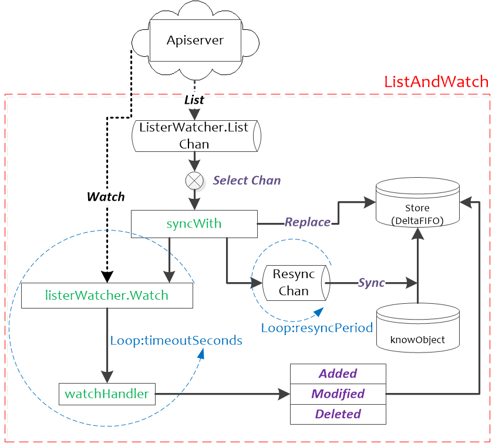

ListAndWatch在Reflector.Run函数中启动，并以Reflector.period周期性进行调度。ListAndWatch使用resourceVersion来获取资源的增量变化：在List时会获取资源的首个resourceVersion值，在Watch的时候会使用List获取的resourceVersion来获取资源的增量变化，然后将获取到的资源的resourceVersion保存起来，作为下一次Watch的基线。具体流程如下图:

架构图

